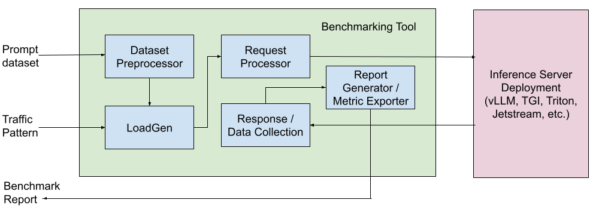

# Design

This document describes the high level design for the tool. It includes the
following components.

## Dataset Preprocessor

Dataset Preprocessor takes in a known dataset like ShareGPT or OpenOrca as the
input and pre-processes them by making sure the prompt length and generation
length are aligned with the user input to support different options like fixed
input / output length tests, variable length tests (larger input / smaller
output and the vice versa). This allows us to support different GenAI use cases
like chat completion, summarization, code completion, etc. depending on the
dataset and the benchmarking user’s inputs.

### Trace replay pipeline

Recorded workloads (OpenTelemetry traces, Weka traces) go through one shared
pipeline. A trace format is a parser that turns its source into a list of
`RawCall`s: one LLM call each, with its messages, recorded output, token counts
and timestamps. From there everything is format-neutral and lives in
`inference_perf/datagen/replay/replay_graph_builder.py`: `build_graph` infers
which calls depend on which, splits each prompt into the segments a predecessor
already sent (the KV cache reuse opportunity), tags the events whose output
reaches the user, and produces the `ReplayGraph` the session load generator
replays. Adding a trace format means adding a parser that produces `RawCall`s,
not a new replay path.

### Workload record layer

A recorded workload is stated in two parts. Records are the content: a
conversation as ordered turns, each turn a list of parts. The arrangement is the
delivery: one node per request, naming the assistant turn it elicits, when it
goes out and what it waits for. A trace format is a parser that produces both,
and nothing after the parser knows which format it read. The schema lives in
`inference_perf/workload/` and is versioned `v1alpha1`.

Each field is there because some format records something the others do not:

| Field | What it states | Formats that need it |
| --- | --- | --- |
| `SyntheticPart.num_tokens` | Text to build to a length, because only the length was recorded | Azure, Mooncake, TraceLab, Weka |
| `SyntheticPart.block_ids`, `block_size` | The leading prefix blocks. Equal ids are equal text, which is what makes a cache hit reproducible without the text | Mooncake and Weka record them, TraceLab's are minted from its cached-prefix count |
| `SyntheticPart.scope` | Where a block id means the same text | `trace` for Mooncake (ids are global to the file), `session` for Weka and TraceLab |
| `Turn.output_tokens` | The output length to ask the server for | All |
| Parts on an assistant turn | The recorded reply, so a later prompt that carries it can be recognized | Weka, recorded conversations |
| `Record.session_id` | Which records belong to one session | Weka, TraceLab |
| `Node.send_at_ms` | The recorded send time | All; it is the schedule for Azure and Mooncake |
| `Node.depends_on`, `think_ms` | The requests this one waits for, and how long after the last of them it goes out | TraceLab (a chain per session), Weka (a graph with subagents) |

Two rules keep the schema this small:

- One node type covers every delivery shape. A node with no dependencies is a
  timestamped request; a node with dependencies is one call of a session. Which
  scheduler runs an arrangement follows from whether any node has dependencies.
- A round that recorded its whole prompt is its own record. A record's turns
  accumulate: the prompt for a node is every turn before the one it elicits.
  TraceLab and Weka record each round's full prompt rather than the messages
  added to it, and a prompt can come back shorter than the one before (context
  compaction, a rewind), so their rounds cannot be turns of one record. Each
  round is a record holding that prompt, and `session_id` ties the rounds
  together. There is no per-turn switch for this.

## Load Generator

Load Generator is the component which generates different traffic patterns based
on user input. This can include a fixed RPS test for a predetermined amount of
time or include a way to generate bursts in traffic or other traffic patterns as
desired for autoscaling and other use cases.

## Request Processor

Request Processor provides a way to support different model servers and their
corresponding request payload with different configurable parameters. This makes
our tool model server agnostic and provides a generic way to benchmark different
model servers and produce apples to apples comparison between them. This
component will also support different protocols like http and grpc and options
like request streaming which is important to produce time to first token (TTFT)
metric.

## Response Processor / Data Collector

Response Processor / Data Collector component allows us to process the response
and measure the actual performance of the model server in terms of request
latency, TPOT, TTFT and throughput.

## Report Generator / Metrics Exporter

Report Generator / Metrics Exporter generates a report based on the data
collected during benchmarking. It can also export the different metrics that we
collected during benchmarking as metrics into Prometheus which can then be
consumed by other monitoring or visualization solutions.

## Metrics to Collect

The following are the essential metrics that we want to collect using the
benchmarking tool.

*   Throughput
    *   Output tokens / second
    *   Input tokens / second
    *   Requests / second
*   Latency at different percentiles (mean, median, p90, p99)
    *   Time per output token (TPOT)
    *   Inter-token latency (ITL)
    *   Time to first token (TTFT)
    *   Time per request
*   Request metrics (mean, median, p90, p99)
    *   Prompt tokens
    *   Output tokens

Optionally we also want to collect specific accelerator and model server metrics.

*   Accelerator metrics (mean, median, p90, p99)
    *   Accelerator utilization (duty cycle)
    *   Accelerator memory utilization
    *   Accelerator memory bandwidth utilization
    *   Accelerator power usage
*   Model server metrics (mean, median, p90, p99)
    *   Batch size
    *   Queue size
    *   KV cache usage
